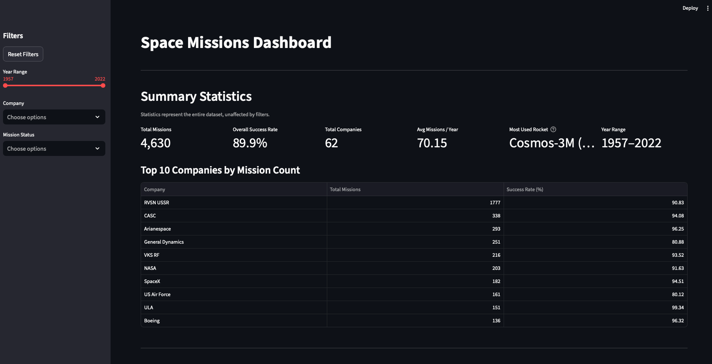
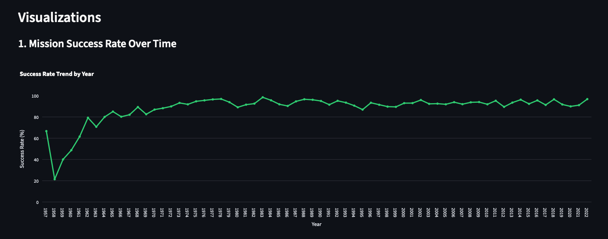
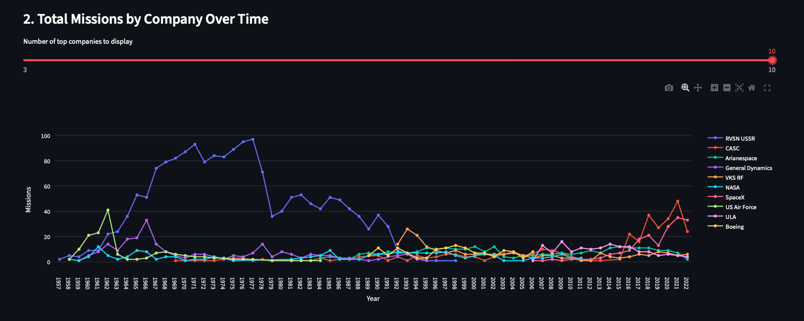
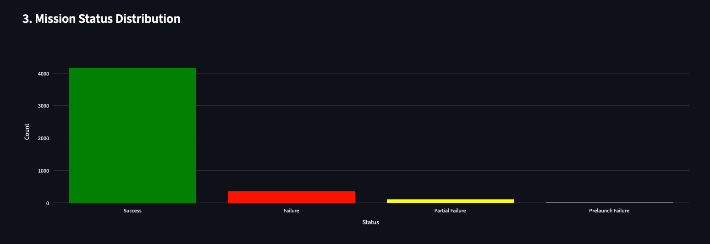
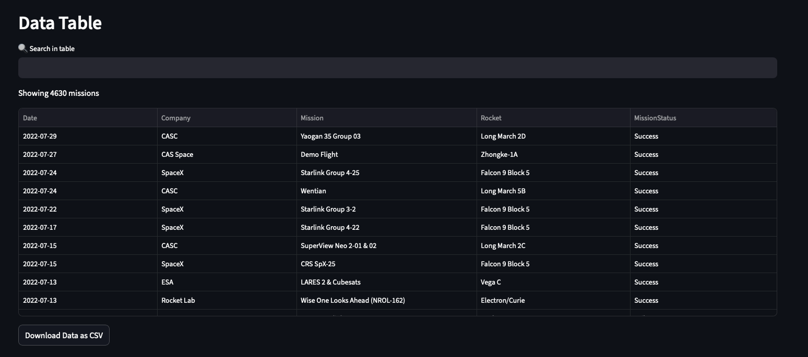
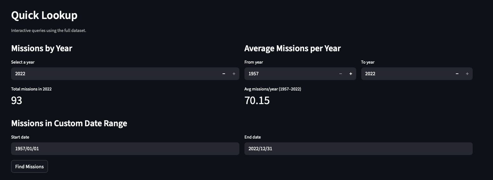

# Space Missions Dashboard

## Screenshots

### Missions Dashboard Summary


### Visualization 1


### Visualization 2


### Visualization 3


### Data Table Search


### Quick Lookup


---

## Get Started

1. **Clone the repo**
```bash
git clone https://github.com/JovelGarcia/space-missions-dashboard
cd space-missions-dashboard
```

2. **Create a virtual environment**
```bash
python -m venv .venv
```

3. **Activate it**

macOS/Linux:
```bash
source .venv/bin/activate
```
Windows:
```bash
.venv\Scripts\activate
```

4. **Install dependencies**
```bash
pip install -r requirements.txt
```

5. **Run the app**
```bash
streamlit run app.py
```

---

## Data Table View
- Contains sorting
- Contains filtering
- Contains search

## 3 Visualizations

### Visualization 1
- I chose this visualization as it shows the success rate trend over time when looking at a general view. In addition, the visualization can be utilized alongside filters to compare success rates between 2+ companies.

### Visualization 2
- I chose this visualization as it shows the formation and demise of the top 10 companies with total missions. In addition, the visualization can be utilized alongside the 'year range' filter to compare how the 'top N' companies by total missions changes over time. Similarly, the 'company' filter can allow for comparisons between 2+ companies.

### Visualization 3
- I chose this visualization as it provides great "at a glance" insights, along with the other 2 visuals, while allowing for specific values (on hover) for totals in success, failure, etc.

## Interactive Filters
- Allows users to filter by date range, company, and mission status — affects all visualizations

## Summary Statistics
- Provides vital insight to entirety of data set: total missions, overall success rate, total companies, average missions per year, most used rocket, and year range.

## Quick Lookup
- Added to utilize ALL `data_processing.py` functions within the frontend.

### Querying total missions given a year
- Utilizes `getMissionsByYear()`

### Average missions per year given a range of years
- Utilizes `getAverageMissionsPerYear()`

### Custom table view of missions given a range of dates
- Utilizes `getMissionsByDateRange()`